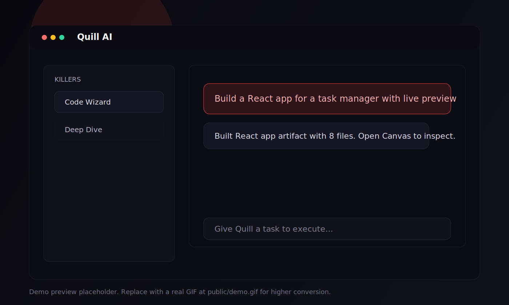

# Quill AI

[](https://github.com/tovrr/quill-ai/actions/workflows/ci-smoke.yml)

Quill AI is a personal AI agent and builder experience for research, writing, coding, and app/page generation.

Research, write, code, and build in one flow. Ask Quill for a result, inspect it in Canvas, and iterate fast.

Live app: https://quill-ai-xi.vercel.app

## Who Quill Is For

- Founders and indie builders shipping landing pages and MVP UI quickly
- Developers who want AI-generated app artifacts with inspectable code
- Teams that need one assistant for research, writing, and technical execution

## Product Demo



Demo note: the repository currently includes a static preview image.
When ready, add a short `public/demo.gif` and use `scripts/prepare-demo-gif.ps1` to optimize capture/output.

## Modern Local Setup (Step-by-Step)

```bash
npm install
cp .env.example .env.local
npm run dev
```

Open http://localhost:3000

Recommended validation before opening PRs:

```bash
npm run typecheck
npm run lint
npm run build
```

## Use Cases

- Build a polished landing page artifact and refine sections one by one
- Generate a React app artifact and inspect code/preview in Canvas
- Export a Next.js bundle artifact for local setup and validation
- Run research and writing workflows in the same conversation

## Why Quill

- Multi-mode AI chat experience (fast, thinking, pro)
- Builder artifacts for page, react-app, and nextjs-bundle workflows
- Live canvas with code/preview flows
- Image generation support
- Auth, entitlement gating, and usage tracking foundations

## Core Capabilities

- Agent chat with streaming responses
- Artifact parser and quality/readiness checks
- React preview sandbox generation
- Next.js bundle export workflow
- API health and smoke test coverage

## Credibility Signals

- CI smoke checks on push and pull requests
- Typed artifact parsing and readiness checks
- Deployment hardening checklist and operational guidance
- Security and contribution policy docs for public collaboration

## Quick Start

### 1) Install

```bash
npm install
```

### 2) Configure env

Copy `.env.example` to `.env.local` and fill required values.

Required keys:

- `DATABASE_URL`
- `BETTER_AUTH_SECRET` (use a long high-entropy value, for example `openssl rand -base64 48`)
- `BETTER_AUTH_URL`
- `GOOGLE_GENERATIVE_AI_API_KEY`

### 3) Run app

```bash
npm run dev
```

Open http://localhost:3000

## Repo Navigation

- App source: `src/`
- API routes: `src/app/api/`
- Builder and parsing logic: `src/lib/`
- CI workflow: `.github/workflows/ci-smoke.yml`
- Deployment runbook: `DEPLOYMENT_CHECKLIST.md`

## Scripts

- `npm run dev` - Start development server
- `npm run build` - Build production app
- `npm run start` - Start production server
- `npm run lint` - Run lint checks
- `npm run typecheck` - Run TypeScript checks
- `npm run bundle:check` - Enforce bundle budgets
- `npm run audit:ui-standards` - Generate UI standards debt report
- `npm run enforce:ui-standards` - Enforce UI no-regression guardrails

Database scripts:

- `npm run db:generate`
- `npm run db:push`
- `npm run db:studio`

## Reliability

- CI smoke workflow: `.github/workflows/ci-smoke.yml`
- UI standards workflow: `.github/workflows/ui-standards.yml`
- Deployment hardening checklist: `DEPLOYMENT_CHECKLIST.md`
- UI standards policy: `UI_STANDARDS.md`

## Tech Stack

- Next.js 16 (App Router)
- React 19
- TypeScript
- Tailwind CSS 4
- Drizzle ORM + Neon Postgres
- Better Auth
- AI SDK + Google/OpenAI providers

## Contributing

Please read [CONTRIBUTING.md](CONTRIBUTING.md) before opening pull requests.

## Security

Please read [SECURITY.md](SECURITY.md) to report vulnerabilities responsibly.

## Code of Conduct

All contributors are expected to follow [CODE_OF_CONDUCT.md](CODE_OF_CONDUCT.md).

## License

MIT - see [LICENSE](LICENSE).

## If This Helps You

Please star the repository and share it with one builder or developer who would benefit from this workflow.

## Launch Messaging Snippets

Short launch post (X/LinkedIn):

I shipped Quill AI: a personal AI agent + builder canvas for research, writing, coding, and app artifact generation.
It can generate page, react-app, and nextjs-bundle outputs, then let you inspect and iterate fast.
Open source: https://github.com/tovrr/quill-ai

Indie community post:

Built Quill AI to reduce the gap between prompt and production-ready output.
Main loop: ask -> generate artifact -> inspect in canvas -> refine sections.
Would love feedback from builders shipping MVPs fast.

For a release-ready checklist, see RELEASE_CHECKLIST.md.
